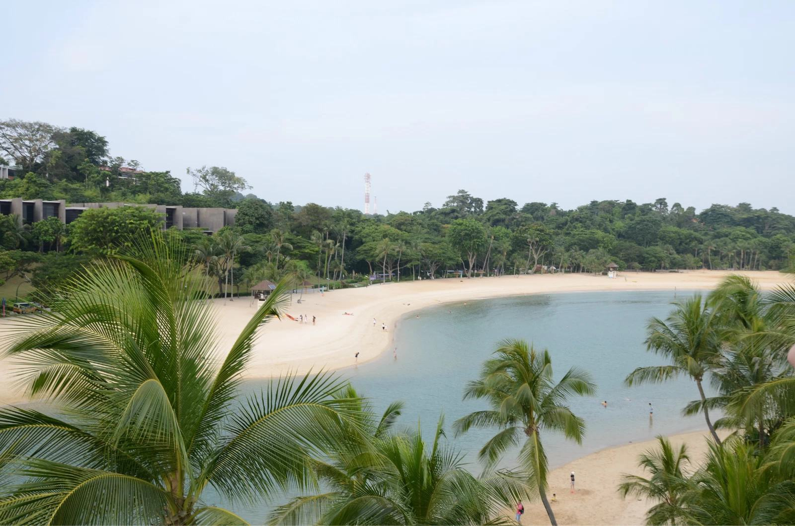
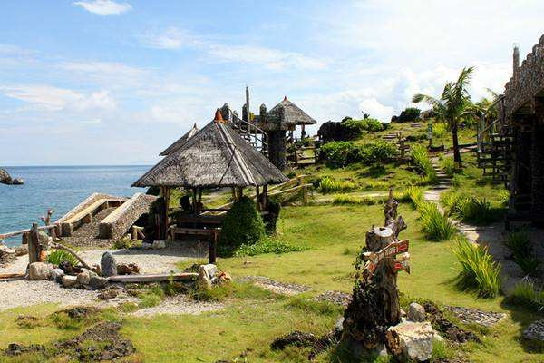
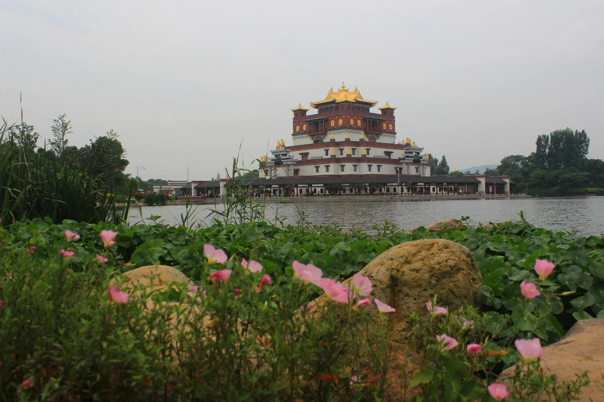
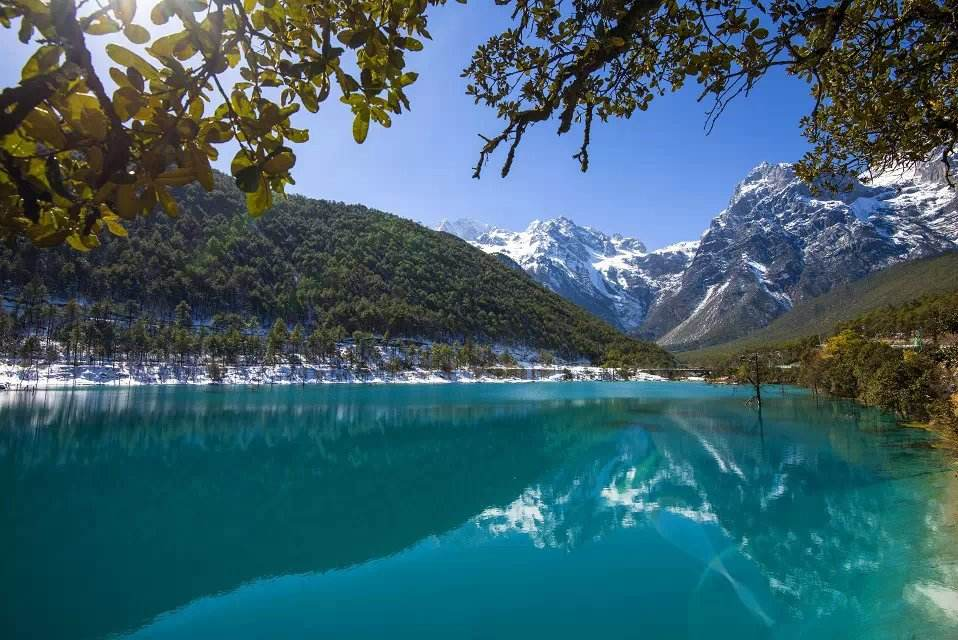
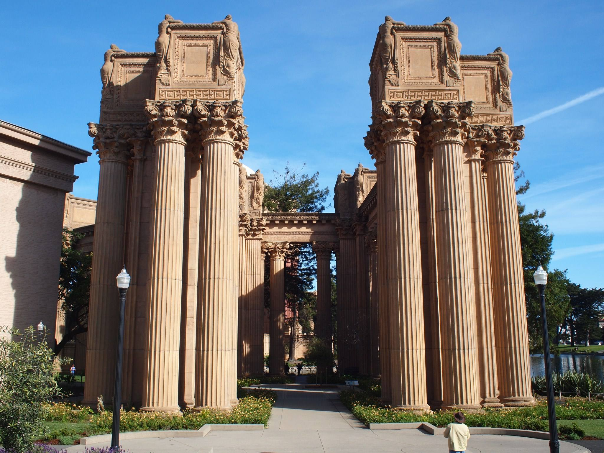
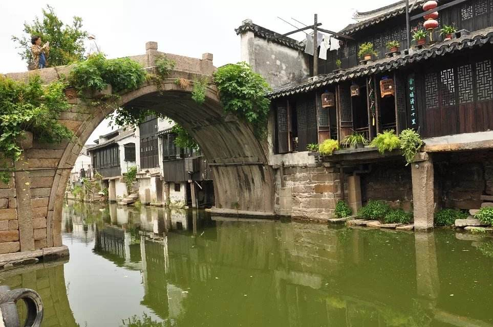
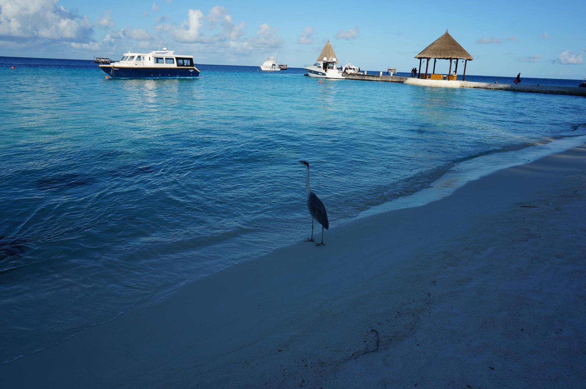

#开发报告
========
**策划思路**
本网站旨在宣传我新建的网站-杭电旅游网
因为时间的问题，网站还没有被认知，现在亟待提升知名度。此网站也可以说是大体的只为大家介绍一下一些好的景点，仅供大家欣赏。因为自己的技术还不够成熟，还有时间也比较短，做的比较仓促，所以效果还不是太好。并且此网站并非以盈利为目的。希望以后继续完善，可以为大家更好的服务。

**网页结构**
到目前为止，一共有五个网页，分别是主页index，副页大学生旅游调查表，副页澳大利亚风情页，副页达尔文，副页个人信息。每个页都能够互通，每个页面都有其独特的内容，详细的介绍了部分景点。
主页链接为：

**技术指标**
兼容浏览器IE9+，firefox等等，使用html5及css3，进行开发，编译器为WS。

**开发技术点**
-----------
**开发过程遇到的技术难题1**
第一个难题就是首页的轮播图，当时弄了很久，没有弄出来。脑袋都快炸了，，，最后我同学帮我弄了一下，然后成功了。
```
<script type="text/javascript">
    var curIndex = 0;
    var auto = setInterval(function () {
        if(curIndex >= $(".imgList li").length -1){
            curIndex = 0;
        }
        else
            curIndex++;
        changeTo(curIndex);
    },2500);
    function changeTo(num) {
        $(".imgList").find("li").removeClass(".imgOn").hide().eq(num).fadeIn().addClass(".imgOn");
    }
</script>

```

**开发过程遇到的技术难题2**
第二个难题就是，我的第二个个网页的排版。这个花费了我好久的时间，心累。
 *{padding: 0;margin: 0;}
        a{text-decoration:none;color: black;}
        .content{width: 1200px; margin: 0 auto;background-color: rgb(240,240,240);height: 1140px;padding-top: 40px;}
        .nav{width:100%;background-color:#333;text-align:center;height:50px;overflow: hidden}
        .nav a{font-size: 24px;display: block;color: white;line-height: 50px;}
        .nav a:hover{color: black;background-color: #999}
        .nav ul{width:1200px; margin: 0 auto;}
        .nav ul li{float: left;width: 180px;list-style: none;}
        .left{width: 300px;float: left;border-right: 1px solid #4b4b4b; height: 1140px;padding-left: 40px;}
        .left ul{padding-top: 30px;}
        .left ul li{height: 40px;line-height: 40px;border-bottom: solid 1px #4b4b4b;}
        .right{margin-left: 400px;height: 1000px;}
        .right .pic{float: left}
        .right .text{padding-left: 350px;padding-right: 40px;}
        .right .text p{text-indent: 2em;height: 200px;}
        .div1{height: 240px;border-bottom: solid 1px rgb(220,220,220); padding-top: 40px;}
**难点三**
难点三是主页的第二个轮播图，现在还有一点瑕疵。尴尬
```
<div class="box">
	<div class="picbox">
		<ul class="piclist mainlist">
			<li><a href="" target="_blank"></a></li>
			<li><a href="" target="_blank"></a></li>
			<li><a href="" target="_blank"></a></li>
			<li><a href="" target="_blank"></a></li>
            <li><a href="" target="_blank"></a></li>
			<li><a href="" target="_blank"></a></li>
			<li><a href="" target="_blank"></a></li>

		</ul>
        <ul class="piclist swaplist"></ul>
	</div>
    <div class="og_prev"></div>
    <div class="og_next"></div>
</div>
```
**开发心得与体会**
经过这次开发后，我对html与css有了一定的了解，也有了一定的掌握。因为去年没有学过，所以今年做的比较吃力，熬了将近两个星期的夜，有几天都弄到了凌晨四点左右，最终有了今天的这个网站。虽说现在也不是会了很多吧，但是做出来以后还是很高兴。尽管它不是特别美观，不是特别归整，但是他有了自己的努力，就变得不一样了。尽管对于其他去年学过的，还是有不小的差距。但是我相信经过自己以后的努力，自己一定变得更好。最后就是因为自己做了这个网页，现在的自己特别开心，感觉收获颇多。无论以后会不会在这方面上工作，自己都不会扔下它，因为它已经引起了我的兴趣。最后谢谢老师一个学期的耐心教学。真心感谢！！！


